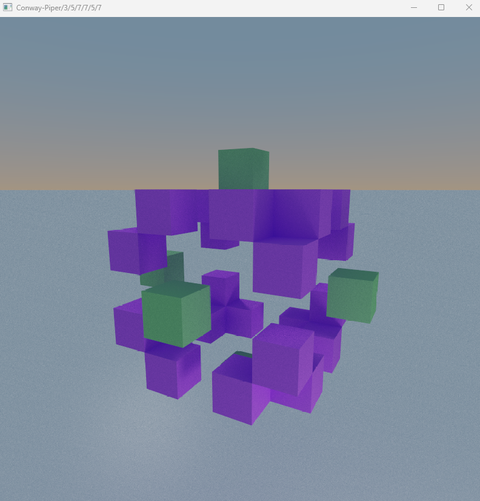

# Conway-Piper

* Conway's Game of Life is a cellular automaton that is played on a 2D square grid. The rules for this are well known: https://en.wikipedia.org/wiki/Conway%27s_Game_of_Life
* Conway-Piper adds a third dimension, hence 3D, and updates the rules for when cells with neighbours, live, dies, or grows.
* Press the 'G' key to step to the next generation.
* Press the '1' key to place a cell where the camera is looking.
* Press the '0' key to delete where the camera is looking.
* The standard Conway rules ( https://en.wikipedia.org/wiki/Conway%27s_Game_of_Life#Rules ) are expresssed as:
	* rule3D = false
	* ruleCellDiesFewerThan = 2
	* ruleCellLivesFewerThan = 4 (i.e. 2 to 3)
	* ruleCellDiesMoreThan = 3
	* And an extra range for when an empty cell grows into a new cell. This range accounts for the optional extra dimension. i.e. Exactly 3 cells in this case.
		* ruleCellGrowsMoreThan = 2
		* ruleCellGrowsFewerThan = 4
	* This can be expressed as Conway-Piper/2/2/4/3/2/4
		* i.e. /2/ dimensions followed by the rule values above in order separated by /
* This is displayed using StormCreeper's voxel renderer

## Examples renders:

# StormCreeper's Voxel renderer

This is a voxel renderer that uses a 3D texture to store the voxel data, and pathtracing with sample accumulation do to the render.
It also supports primitives like spheres, has progressive bloom and adaptative samples count.

# Conway-Piper changes

* Original voxel render source from: https://github.com/StormCreeper/Voxel_Renderer/tree/master
* Added key 'G' to flag generateCells, which generates a new cell lifetime step using 3D rules based on Conway's Game of Life, hence Conway-Piper

## Windows libs included

x86: http://sourceforge.net/projects/glew/files/glew/1.9.0/glew-1.9.0-win32.zip/download
x64: http://sourceforge.net/projects/glew/files/glew/1.9.0/glew-1.9.0-win64.zip/download
